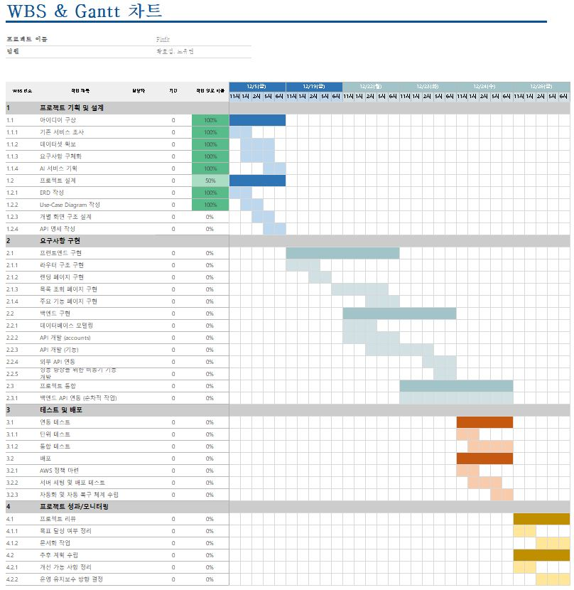
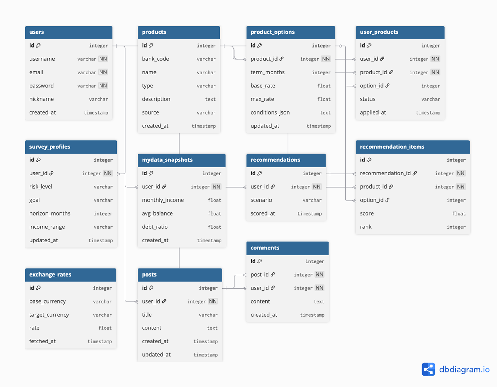
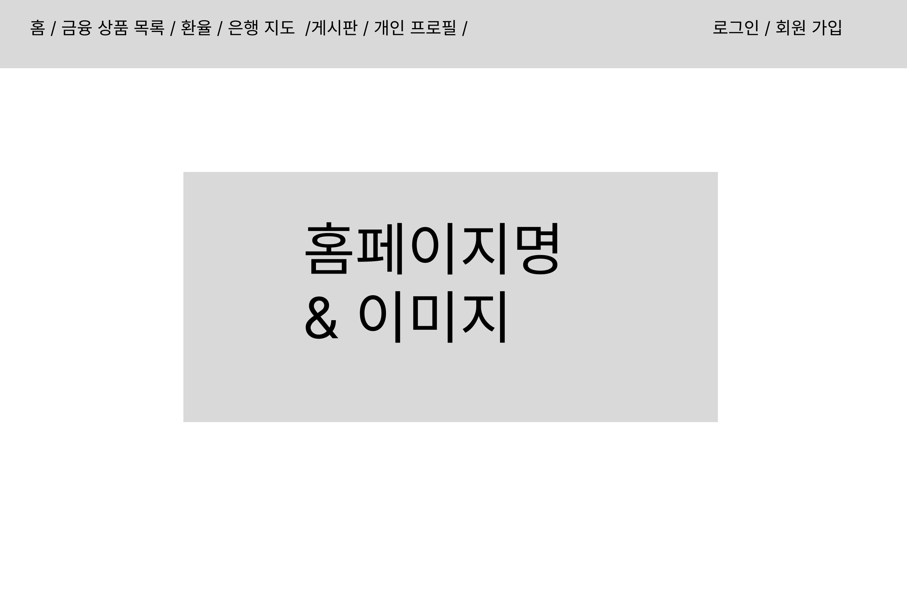
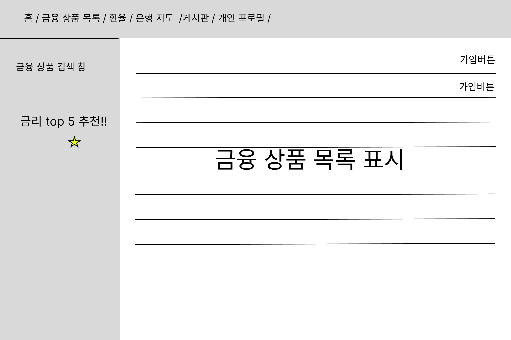
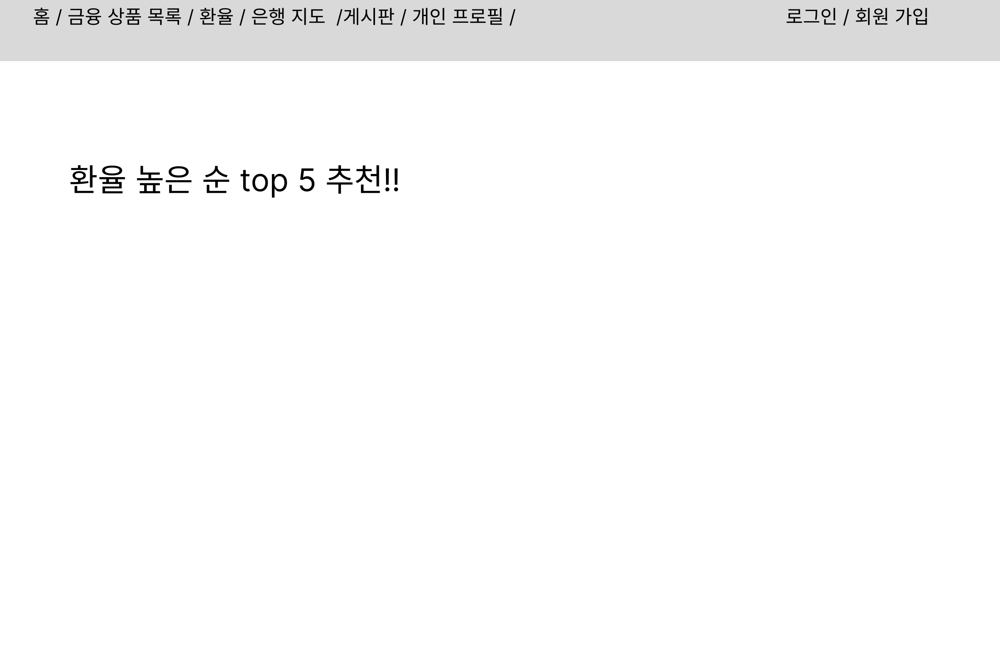
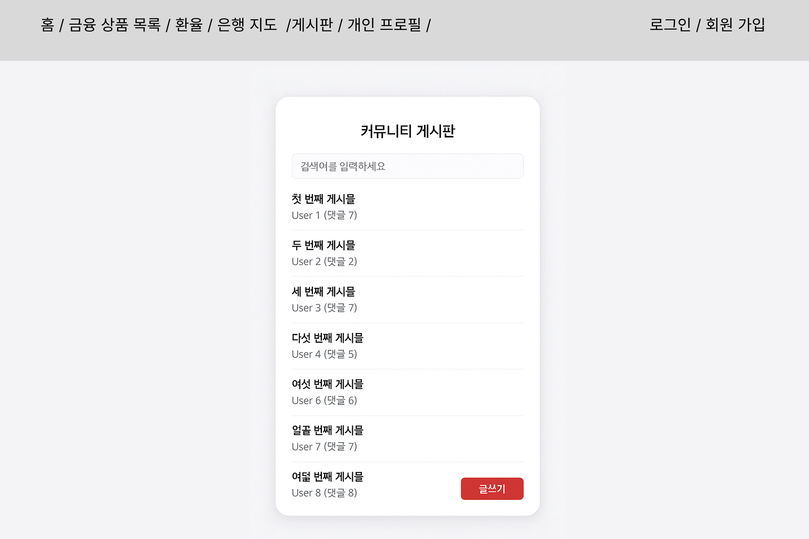
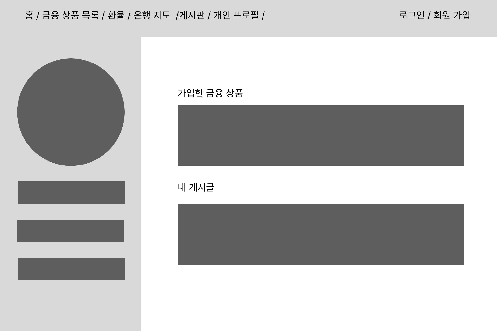
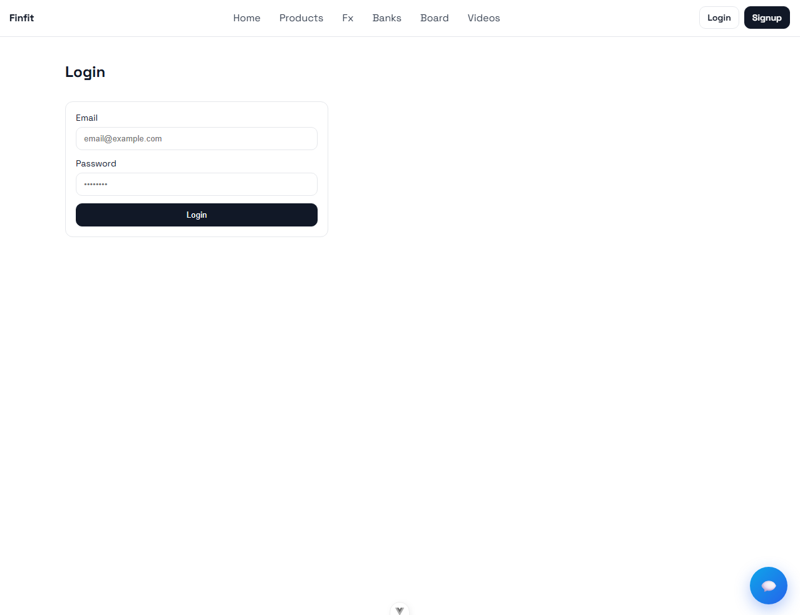
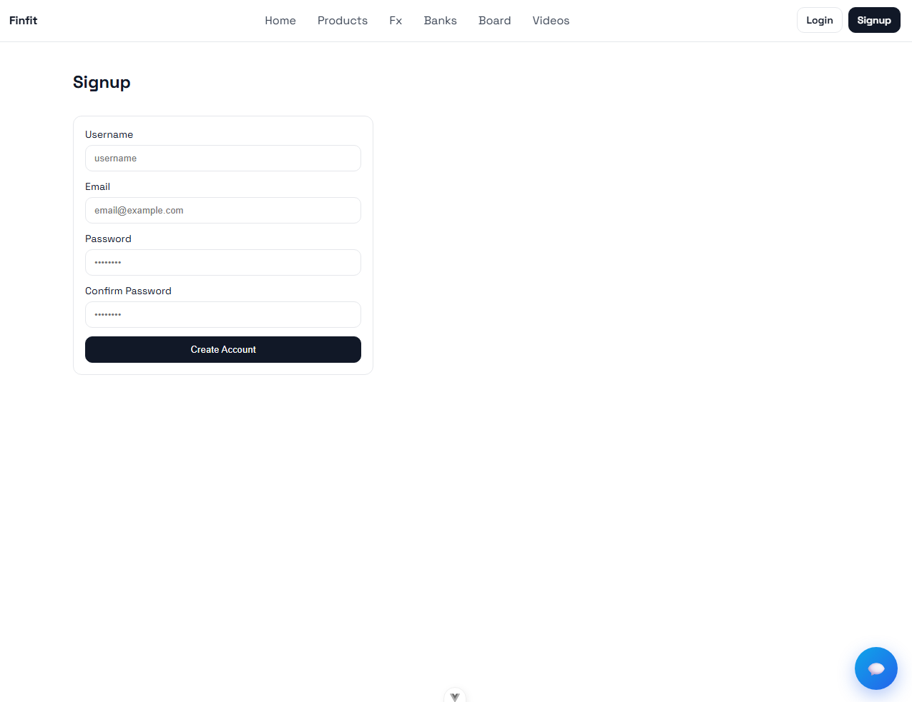

# SSAFY 맞춤 금융상품 추천 서비스 FinFit

> **서울 6반 4조** - 금융 상품 비교·추천 + 환율 + 근처 은행 찾기까지 한 번에!  
> 금융감독원·한국수출입은행·카카오맵 API를 활용한 사용자 맞춤형 금융 웹 서비스

## 서비스 개요

- 금융 상품 가입 및 마이페이지 관리
- 사용자에게 **맞춤형 정기예금 상품 추천**
- 실시간 **환율 조회·계산·차트**
- 위치 기반 **근처 은행 지도 검색**
- 자유로운 금융 정보 공유를 위한 **커뮤니티 게시판**

## 주요 기능

| 기능                  | 설명                                                                  |
|-----------------------|----------------------------------------------------------------------|
| 회원가입 / 로그인      | 사용자 인증 회원관리 시스템                                               |
| 금융상품 목록 & 검색   | 금융감독원 API 연동 → 정기예금 상품 조회·검색                               |
| 금리 TOP5 추천        | 최고 금리 기준 상위 5개 상품 추천                                          |
| 상품 가입 신청        | 관심 상품에 바로 가입 신청                                                 |
| 환율 계산기 & 차트     | 한국수출입은행 API → 환율 계산 및 기간별 차트                               |
| 근처 은행 찾기        | Kakao Map API 연동 → 위치 기준 은행 마커 표시                              | 
| 커뮤니티 게시판       | CRUD 완비, 작성자만 수정/삭제 가능                                         |
| 마이페이지            | 가입한 상품, 나의 게시글 조회, 회원정보 수정, 탈퇴                           |

## 작업 분해 및 계획

## 프로젝트 구조
### ERD (Entity Relationship Diagram)

### UCD (Use Case Diagram)

# 화면설계

- figma 링크
https://www.figma.com/design/hVRARKTw7g033STaYzLGvy/%EC%A0%9C%EB%AA%A9-%EC%97%86%EC%9D%8C?node-id=0-1&t=TphFpSBO6CFi0nbf-1

- 화면 목록
홈페이지 / 금융 상품 목록 / 환율 / 은행 지도 / 게시판 / 개인 프로필 / 로그인 / 회원 가입

### 상세 이미지

#### 홈페이지 

#### 금융 상품 목록 

#### 환율 

#### 은행 지도 

#### 게시판

#### 개인 프로필 

#### 로그인

#### 회원 가입 

====================================================================================================================================================

💎 FinFit: AI 기반 맞춤형 금융 상품 추천 서비스

"당신의 금융 라이프스타일에 딱 맞는(Fit) 금융(Finance) 솔루션"

FinFit은 방대한 예적금 상품 데이터와 실시간 FX(금·은) 시세를 분석하여, 생성형 AI가 사용자에게 가장 유리한 금융 상품을 직관적으로 큐레이션해주는 스마트 플랫폼입니다.

✨ Key Features

🏦 Smart Deposit & Savings Comparison

금융권 통합 필터링: 여러 은행의 상품을 한곳에서 비교하고, 원하는 은행만 골라보는 필터링 기능.

금리 TOP 5 대시보드: 복잡한 검색 없이 현재 시장에서 가장 높은 수익률을 기록 중인 상위 5개 상품을 메인에 노출.

상세 가이드: 우대 조건, 가입 대상, 금리 옵션을 한눈에 파악할 수 있는 유저 친화적 UI.

📈 FX(Gold/Silver) Market Visualizer

시계열 데이터 분석: 과거 Excel 기반 시세 데이터를 분석하여 특정 기간 내의 가격 변동 추이 제공.

인터렉티브 차트: Chart.js를 이용해 금과 은의 가격 변화를 시각화하여 투자 타이밍 파악 지원.

🤖 AI Financial Advisor (Chatbot)

자연어 기반 추천: 사용자의 질문(예: "사회초년생이 가입하기 좋은 높은 금리의 적금은?")을 이해하고 최적의 상품 선별.

데이터 기반 근거 제시: 단순 나열이 아닌, 해당 상품을 추천하는 구체적인 이유(우대 조건, 금리 등)를 함께 설명.

🛠 Tech Stack

Backend

Framework: Django REST Framework (DRF)

Language: Python 3.x

Data Processing: Pandas (Excel Data Parsing & Filtering)

Database: SQLite

Frontend

Framework: Vue.js 3

State Management: Pinia / Vuex

Visualization: Chart.js

Styling: CSS3 / Scss

🧠 Technical Deep Dive

1. AI 추천 알고리즘 (Recommendation Logic)

사용자의 입력을 바탕으로 최적의 상품을 정렬하기 위해 내부적으로 다음과 같은 Scoring 프로세스를 거칩니다.

$$Score = (w_1 \times BaseRate) + (w_2 \times MaxRate) + (w_3 \times UserPreference)$$

키워드 추출: NLP를 통해 사용자 질문에서 연령대, 상품 유형, 우대 조건 키워드 분석.

후보군 필터링: DB 내 예적금 상품 중 조건을 만족하는 후보군 1차 선별.

가중치 기반 정렬: 우대 금리 포함 여부와 기간 선호도에 따라 상위 N개 상품 선정.

2. 생성형 AI 활용 방식

단순 텍스트 응답을 넘어, 백엔드에서 가공된 **구조화된 상품 데이터(JSON)**를 GPT 모델에 전달하여 사용자 친화적인 요약 문장을 생성하도록 프롬프트를 설계했습니다.

👥 Team & Roles

성명역할상세 기여 내용황효섭Backend Lead• API 아키텍처 설계 및 구현

• Pandas를 이용한 금융 데이터 전처리

• 추천 엔진 엔드포인트 연동 및 서버 환경 구축

노유연Frontend Lead• Vue 기반 싱글 페이지 애플리케이션(SPA) 설계

• Chart.js 시각화 인터페이스 및 챗봇 UI/UX 구현

• 비로그인 유저 권한 제어 로직 및 라우팅 관리

📂 Project Structure

Bash

FinFit/

├── backend/

│   ├── api/             # 금융 상품 및 FX 데이터 처리 API

│   ├── data/            # 금융 상품 및 FX 원천 데이터(Excel)

│   └── chatbot/         # AI 추천 로직 및 GPT 연동

├── frontend/

│   ├── src/

│   │   ├── components/  # 재사용 가능한 UI 컴포넌트

│   │   ├── views/       # 주요 화면 (Main, Product, FX, Chat)

│   │   └── store/       # 상태 관리 로직

└── README.md

💬 Project Retrospective

"기술적 도전과 성장"

황효섭: "프론트엔드와 백엔드가 유기적으로 연결되기 위해 API 응답 데이터의 일관성이 얼마나 중요한지 체감했습니다. 데이터 가공 과정에서의 예외 처리를 통해 시스템의 안정성을 확보하는 법을 배웠습니다."

노유연: "사용자가 복잡한 금융 정보를 어떻게 하면 더 쉽게 받아들일 수 있을지 고민하며 UI/UX를 설계했습니다. 특히 챗봇의 응답 흐름과 차트 시각화를 통해 데이터 가시성을 높이는 과정이 매우 뜻깊었습니다."
